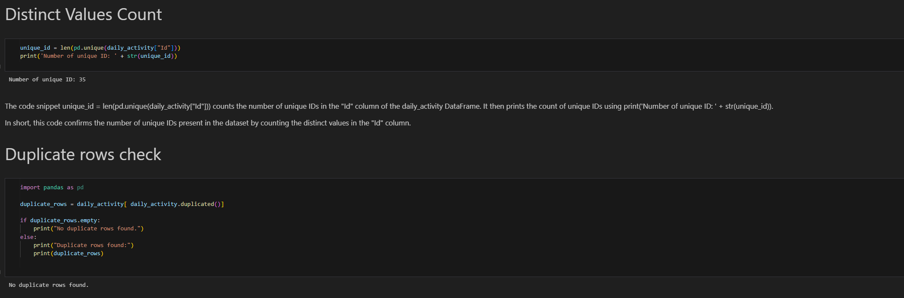

# Fitbit Data Analysis Project

## Overview
This project aims to analyze data obtained from the Fitbit device of the user and provide valuable insights, correlations, and trends. By analyzing various aspects of health and fitness data, we seek to understand lifestyle impacts, sleep patterns, activity trends, and more.

## Project Objectives
- **Data Analysis for Health and Fitness Trends:** Analyze Fitbit data to identify trends related to health and fitness.
- **Lifestyle Impact Study:** Study the impact of lifestyle choices on health and fitness metrics.
- **Sleep and Activity Correlation Analysis:** Explore correlations between sleep patterns and activity levels.
- **Activity Patterns on Weekdays vs. Weekends:** Compare activity patterns between weekdays and weekends.

## Deliverables
- **Comprehensive Analysis Report:** A detailed report summarizing the findings, insights, and correlations discovered during the analysis.
- **Interactive Visualizations:** Interactive visualizations will be provided for stakeholder presentations, making it easier to communicate key insights.

## Technologies Used
- Python
- Pandas
- NumPy
- Matplotlib
- Seaborn

## Getting Started
To get started with the project, follow these steps:
1. Clone the repository to your local machine.
2. Install the required dependencies by running `pip install -r requirements.txt`.
3. Run the main analysis script to perform data analysis.
4. Explore the generated visualizations and analysis report.

## Data Acquisition
The dataset used in this project was obtained from Kaggle. You can find the dataset [here](https://www.kaggle.com/datasets/singhakash/fitbit-dataset/data?select=FitBit+data.csv).
The dataset contains a total of 457 observations and 18 features. These features include various metrics collected from the Fitbit device, such as steps taken, heart rate, sleep duration, and activity levels.

## Data Cleaning and Preprocessing

During the data cleaning and preprocessing phase, we performed the following steps:

### Missing Values
We first analyzed if there were any missing or NULL values. Here are our observations:
- The data consists of 18 columns and 457 rows.
- There are no Null or missing values.
- The column 'ActivityDate' was wrongly classified and needed to be converted to datetime64 dtype.
- There are 33 distinct IDs in the dataset.

  

### Duplicate Row Check
We conducted a check for duplicate rows in the dataset to ensure data integrity and consistency.

## Data Analysis

We have followed the following steps in our data analysis:

1. **Data Extraction:** We extracted the Fitbit data from the provided dataset.

2. **Data Cleaning and Preprocessing:** The dataset underwent cleaning and preprocessing steps to handle missing values, remove duplicates, and standardize data types.

3. **Exploratory Data Analysis (EDA):** We conducted exploratory data analysis to gain insights into the distribution, relationships, and patterns within the data.

4. **Feature Engineering:** Additional features were engineered to capture relevant information and improve the predictive power of our models.

   

5. **Statistical & Data Analysis:** 

    - The dataset reveals that users, on average, logged approximately 6,547 steps per day.
    - Sedentary behavior is prevalent, with users spending an average of 991 minutes per day in sedentary activities.
    - Caloric expenditure averaged at 2,189 calories per day.
    
    These findings underscore the importance of promoting increased physical activity to enhance overall health and well-being.

   

   

   

6. ### **Visualizations:** Visualizations such as histograms, scatter plots, and heatmaps were created to visualize the patterns and relationships discovered during analysis.

   **Insights from Number of times user logged in app across the week:**

   

   **Insights from Distribution of Total Steps:**
   
   
   
   **Insights from Calories burned per step taken:**
   
   

   **Insights from Activity average weekdays vs weekends in minutes:**
   
   
   
   **Insights from Percentage of activity in minutes:**
   
   

   **Insights from Sleep Quality duration by day of the week:**
   
   

7. ## Results & Future Work

We processed FitBit data alongside sleep data to extract insights into activity levels, step counts, calorie counts, and sleep quality. Through comprehensive analysis, we identified trends such as user engagement patterns, focus on sedentary activities, and correlations between activity and sleep. This analysis serves as a foundation for future trend forecasting and deeper analysis, guiding potential enhancements to the FitBit app and related health products

### Identified Trends
- Use of the FitBit app for tracking sedentary activities (81.3%) indicates a focus on monitoring daily routines rather than health-conscious behaviors.
- Users display a clear inclination towards activity tracking during weekdays, suggesting a higher level of engagement during workdays compared to weekends.

### Application to Health Products
- These observed trends underscore the importance of developing health products that cater to users' daily routines and encourage consistent engagement throughout the week.

### Sleep and Activity Correlation Analysis
- Future work involves exploring the relationship between sleep patterns and physical activities, aiming to provide insights into the impact of exercise on sleep quality.

### Activity Patterns on Weekdays vs. Weekends
- Analyzing how physical activity varies between weekdays and weekends offers insights into work-life balance and its effects on health.

### Future Work
- The insights gathered from this analysis can be utilized for future machine learning models and data visualization efforts to uncover further correlations and patterns in the data.

